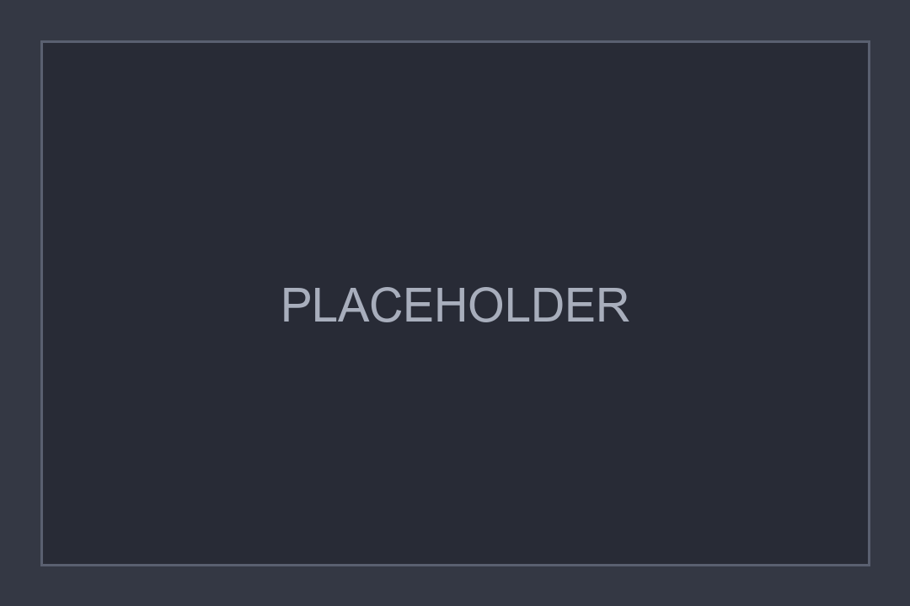

# ComfyUI-4A-StampCensor

[中文说明](README.zh-CN.md)

Scatter stamp / sticker shapes over a mask instead of mosaic. Built-in white (or black-on-white) presets can be tinted from a color picker; custom PNGs keep their own alpha. Detection and mask grow are left to SAM / Impact / Grow Mask.

**Current release: 1.0.0** — Stamp Load, Stamp Custom Load, and Stamp Censor with live node previews.


## Highlights

### Stamp Load + color tint

Pick a built-in shape, tint it with the color picker, and set a base angle. The node preview rotates with the angle; the `STAMP` output stays unrotated so Stamp Censor can apply auto-rotate / jitter on top.


### Custom image

Use **Stamp Custom Load** to drop or pick your own texture. The file is used as-is — no keying, no tint. White backgrounds stay white.


### Custom stamps

Colorable templates go in the [`assets/`](assets/) folder (do not name a file `demo_scene.png`). **Stamp Load** scans that folder and only accepts two tintable formats:

- **White on a transparent background**
- **Black ink on white** (black is kept, white is discarded)

Add or delete a file, then press **R** (Refresh Node Definitions) or reload the page. The filename (without extension) is the preset id in the dropdown.



### Mask scatter with coverage / spacing

Connect `image` + `mask` + `stamp`. Each connected mask region gets its own long-axis heading (optional), random sizes, and oriented-box packing until **target coverage**. Stamps may overflow the mask. An in-node demo preview updates when the stamp is connected.


### Result instead of mosaic

Hearts, scribble bars, stars, crosses, or your own sticker — same mask pipeline, no pixelation.


## Install

### ComfyUI-Manager (recommended)

Search for **4A Stamp Censor** / `ComfyUI-4A-StampCensor` and install.

### Manual

```bash
cd ComfyUI/custom_nodes
git clone https://github.com/tsukino4a/ComfyUI-4A-StampCensor.git ComfyUI-4A-StampCensor
```

No extra pip packages. Restart ComfyUI after install. After changing Python or locale files, restart again; after JS-only edits, hard-refresh the browser (Ctrl+F5).

## Quick start

1. Add **Stamp Load** and **Stamp Censor** from `4A/StampCensor`.
2. Connect `stamp` → `stamp`. Feed `image` and a white-on-black `mask` (YOLO / SAM / Impact / Grow Mask).
3. Queue once. Tweak coverage, size ratio, spacing, and auto-rotate; the bottom demo preview follows when a Stamp Load is connected.
4. Optional: use **Stamp Custom Load** instead of Stamp Load if you have your own PNG.

This plugin does **not** detect NSFW or grow masks. Wire those nodes yourself.

## Nodes

| Node | Role |
|------|------|
| Stamp Load | Built-in preset + color + angle → `STAMP` |
| Stamp Custom Load | Drop / pick a PNG → `STAMP` (no tint) |
| Stamp Censor | Scatter the connected stamp over `mask`; optional seed input |

## Stamp assets

| Path | Purpose |
|------|---------|
| [`assets/`](assets/) | Built-in presets. Every `.png` except `demo_scene.png` is scanned on startup |
| [`assets/demo_scene.png`](assets/demo_scene.png) | Internal demo plate only — never listed as a stamp |

Format rules and refresh steps are under **Custom stamps** above. Shipped shapes (order is fixed; extra files sort after them): `heart_standard`, `heart_wobbly_a`, `heart_soft`, `bar_h_scribble`, `bar_h_thick`, `star_wobbly`, `circle_scribble`, `cross_x`.

## Dependencies

- Pillow and NumPy are provided by ComfyUI; this node adds no extra pip packages

## License

This project is released under the [MIT License](LICENSE).
