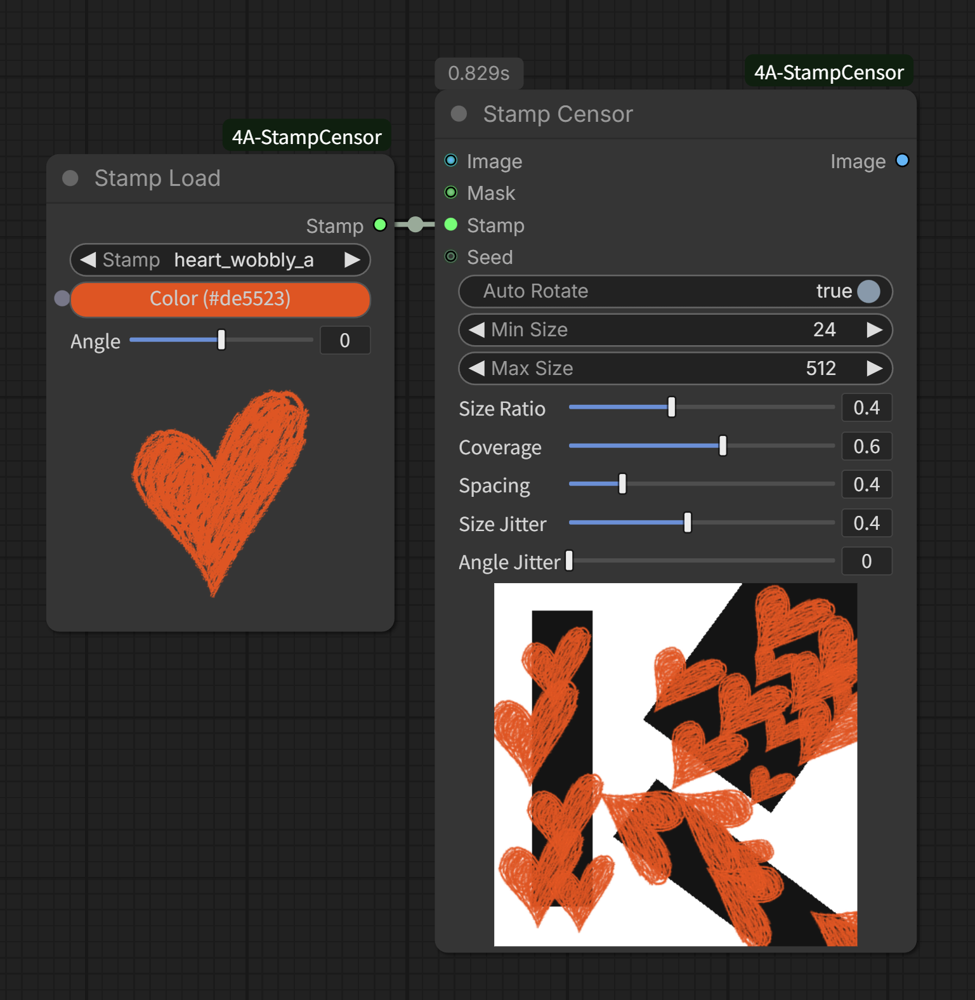
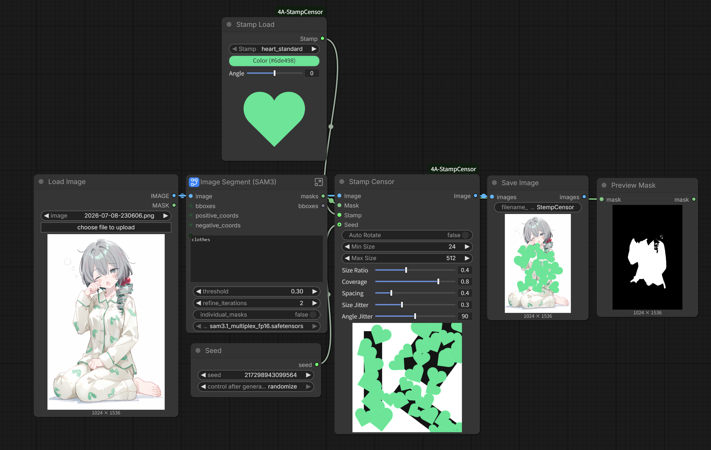
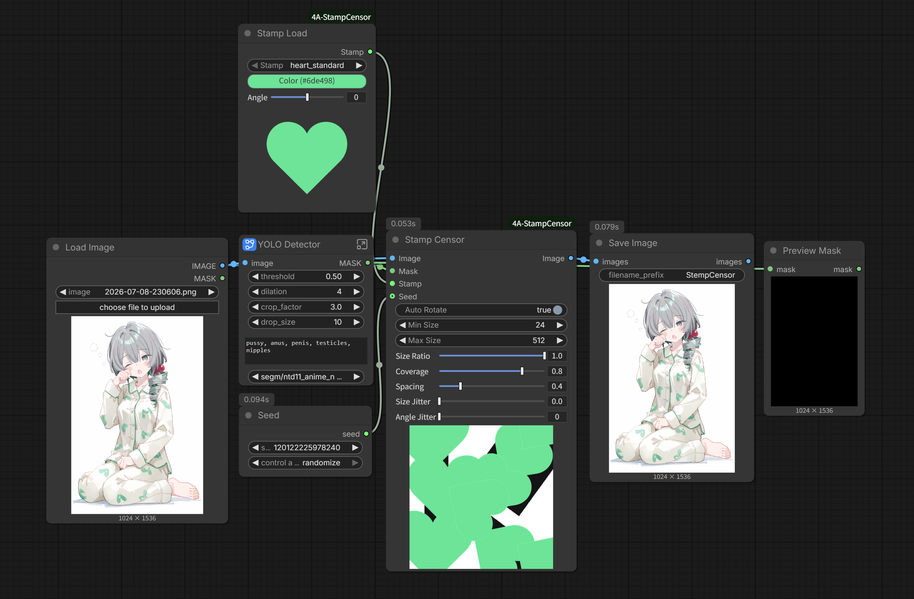

# ComfyUI-4A-StampCensor

[English](README.md)

用贴纸 / 图案铺在遮罩上打码，替代马赛克。内置纯白（或白底黑稿）预设可用色盘上色；自定义 PNG 走自己的透明通道。检测和膨胀请用 SAM / Impact / Grow Mask，本插件不做。

**当前版本：1.0.0** — 贴纸加载、自定义贴纸加载、贴纸打码，节点内可预览。


## 亮点

### 用图案代替马赛克

爱心、涂鸦横条、星星、叉，或你自己的贴纸——同一条遮罩链路，不再像素化。


### 贴纸加载 + 色盘上色

选内置形状、用色盘染色、设初始角度。节点预览会跟着角度转；输出的 `STAMP` 本身不转，留给贴纸打码做自动旋转 / 抖动。


### 自定义图片

用 **自定义贴纸加载** 拖入或点选自己的贴图。完全按原图使用，不做抽底、不上色；白底会保留。


### 自定义贴纸

可以变色的模板请自己放到 [`assets/`](assets/) 文件夹（不要用 `demo_scene.png` 这个文件名）。**贴纸加载** 会扫描这个目录，只认两种可上色格式：

- **透明底白色**
- **白底黑色**（加载时抽黑、丢掉白色）

增删文件后按 **R**（刷新节点定义）或刷新页面，文件名（不含扩展名）就是下拉里的 id。


### 按覆盖率 / 间距铺满遮罩

接 `image` + `mask` + `stamp`。每个连通区域单独算长边朝向（可关）、随机尺寸和旋转矩形碰撞，直到达到**覆盖率**。过小的碎点（比如 SAM 噪点）会按整图比例自动丢掉。贴纸可以溢出遮罩。接好贴纸后，节点底部会更新演示预览。


### 自动旋转

开：每个遮罩连通域先对齐自己的长边朝向，再加上贴纸加载 / 自定义加载的角度。关：只用加载节点的角度。贴纸默认朝上。角度抖动叠在这之后。



## 安装

```bash
cd ComfyUI/custom_nodes
git clone https://github.com/tsukino4a/ComfyUI-4A-StampCensor.git ComfyUI-4A-StampCensor
```

也可以在 ComfyUI-Manager 里搜索 **4A Stamp Censor**。装完重启 ComfyUI。

示例在 [`example_workflows/`](example_workflows/)。跑之前在 Load Image 里换成你自己的图。种子每次排队会随机。

SAM3 · [`01_SAM3_StampCensor.json`](example_workflows/01_SAM3_StampCensor.json)



Impact Pack YOLO NSFW · [`02_ImpactPack_NSFW_StampCensor.json`](example_workflows/02_ImpactPack_NSFW_StampCensor.json)



## 快速开始

1. 从 `4A/贴纸打码` 加上 **贴纸加载** 和 **贴纸打码**。
2. 把 `stamp` 接到 `stamp`。`image` 和遮罩（白色区域会被打码）用你现有的 YOLO / SAM / Impact / Grow Mask。
3. 排队跑一次。调覆盖率、尺寸比例、间距、自动旋转；接的是贴纸加载时，底部演示预览会跟着变。
4. 有自己的 PNG 时，改用 **自定义贴纸加载**。

本插件**不做** NSFW 检测，也不膨胀遮罩，请自己接线。

## 节点一览

| 节点 | 作用 |
|------|------|
| 贴纸加载 | 内置预设 + 颜色 + 角度 → `STAMP` |
| 自定义贴纸加载 | 拖入 / 点选 PNG → `STAMP`（不上色） |
| 贴纸打码 | 在 `mask` 上铺已连接的贴纸；种子口可选 |

## 贴纸资源

| 路径 | 用途 |
|------|------|
| [`assets/`](assets/) | 内置预设。启动时扫描全部 `.png`，**不包括** `demo_scene.png` |
| [`assets/demo_scene.png`](assets/demo_scene.png) | 内部演示底图，不会出现在贴纸列表里 |

格式要求和刷新方式见上面的 **自定义贴纸**。随包装的形状（顺序固定，多出来的文件排在后面）：`heart_standard`、`heart_wobbly_a`、`heart_soft`、`bar_h_scribble`、`bar_h_thick`、`star_wobbly`、`circle_scribble`、`cross_x`。

## 依赖

- Pillow、NumPy 由 ComfyUI 提供，本插件不再额外声明

## 许可证

本项目以 [MIT License](LICENSE) 发布。
